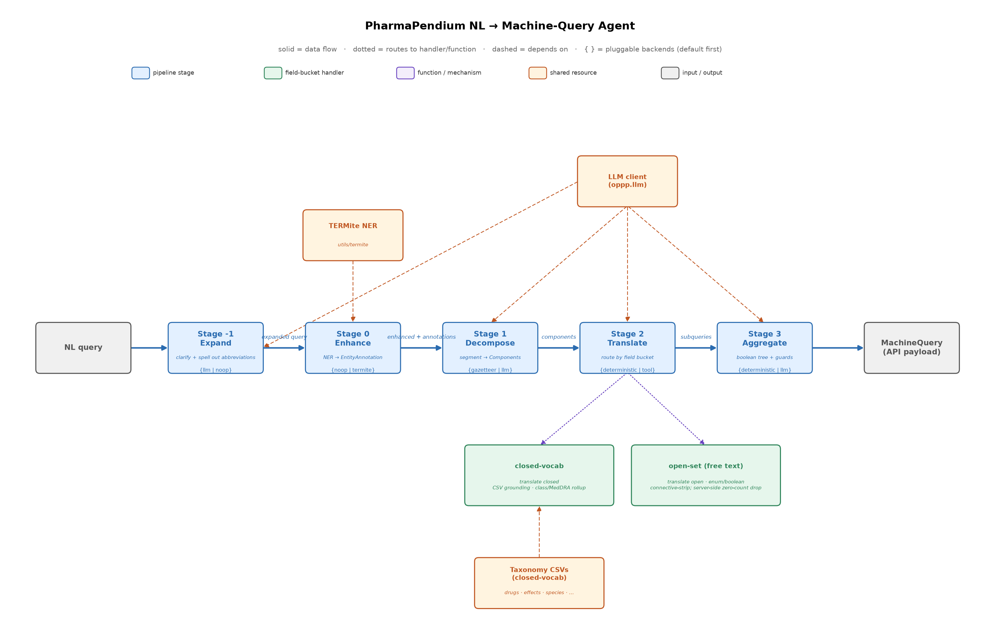

# PharmaPendium NL→Machine-Query Translator

This folder documents the natural-language-to-machine-query translation layer
implemented in [src/oppp/](../src/oppp/). See [index.md](index.md) for the
complete documentation map.

The translator uses a **decomposed, field-by-field pipeline** that grounds
closed-set fields against the taxonomy CSVs in [inputs/](../inputs/) and emits
open-set fields as direct `MATCH` or `REGEX` constraints. Live execution can
optionally run isolated zero-count probes for open-set filters before final
aggregation.

## Reading order

| # | Doc | What it covers |
|---|-----|----------------|
| 0 | [00-overview/problem-statement.md](00-overview/problem-statement.md) | The problem in one page |
| 0 | [00-overview/glossary.md](00-overview/glossary.md) | Shared vocabulary |
| 2 | [02-domain-inputs/machine-query-schema.md](02-domain-inputs/machine-query-schema.md) | The target machine-query format |
| 2 | [02-domain-inputs/field-taxonomy.md](02-domain-inputs/field-taxonomy.md) | The two sets of searchable fields |
| 2 | [02-domain-inputs/csv-catalog.md](02-domain-inputs/csv-catalog.md) | What each CSV in `inputs/` is for |
| 3 | [03-proposed-design/architecture.md](03-proposed-design/architecture.md) | The pipeline: Stage -1, Stage 1 decomposition, TERMite Stage 0, and 3 translation/aggregation stages |
| 3 | [03-proposed-design/stage-1-decomposition.md](03-proposed-design/stage-1-decomposition.md) | NL query → per-field NL subqueries |
| 3 | [03-proposed-design/stage-2-subquery-translation.md](03-proposed-design/stage-2-subquery-translation.md) | NL subquery → machine subquery |
| 3 | [03-proposed-design/stage-3-aggregation.md](03-proposed-design/stage-3-aggregation.md) | Boolean assembly, service invariants, execution, and open-set probe handling |
| 3 | [03-proposed-design/grounding-and-tool-calling.md](03-proposed-design/grounding-and-tool-calling.md) | How CSV grounding + tool calling work |
| 3 | [03-proposed-design/misspelling-strategy.md](03-proposed-design/misspelling-strategy.md) | Fixed handling of user misspellings by field/bucket |
| 4 | [04-examples/worked-examples.md](04-examples/worked-examples.md) | End-to-end traces from the SME gold set |
| 5 | [05-evaluation/gold-set-and-metrics.md](05-evaluation/gold-set-and-metrics.md) | How we measure success — per-step gold set, metrics & LLM-as-judge |
| 6 | [06-implementation/tech-stack.md](06-implementation/tech-stack.md) | Tools/packages, fixed methods, and per-step isolation |
| 6 | [06-implementation/build-status.md](06-implementation/build-status.md) | What's built (the `oppp` package), how to run it, limitations |
| 6 | [06-implementation/operations.md](06-implementation/operations.md) | Install, run, configuration, credentials, and execution model |
| 6 | [06-implementation/streamlit-ui.md](06-implementation/streamlit-ui.md) | The Streamlit demo/debug UI: question picker, run controls, stage outputs |

## Pipeline stages (fixed + isolatable)

The pipeline is **three core stages** (decompose -> translate -> aggregate)
preceded by Stage -1 query expansion and required Stage 0 TERMite enhancement.
Each step has one production method and is runnable on its own for debugging and
evaluation. Stage methods are fixed, and the pipeline does not accept stage
bypasses or replacement methods.

| Stage | Job | Production method | Run alone |
|-------|-----|-------------------|-----------|
| -1 Expand | clarify the query and spell out abbreviations without changing meaning | LLM expansion | full pipeline only |
| 0 Enhance | annotate entities in the decomposed per-field fragments | TERMite NER | `oppp enhance` |
| 1 Decompose | split into single-field components — **no vocab, no guessing** | LLM decomposition seeded by TERMite annotations | `oppp decompose` |
| 2 Translate | translate fields against input closed sets or direct open-set constraints | grounded closed-set tool translation | `oppp field` |
| 3 Aggregate | assemble and validate the API query; live runs may execute it for `countTotal` and probe open-set filters | LLM aggregation with deterministic validation | `oppp aggregate` |

`oppp run` uses LLM expansion, TERMite enhancement, LLM decomposition, grounded
tool translation, LLM aggregation, fuzzy normalization, and API execution. Add
`--no-execute` only when the API call itself should be skipped; this does not
replace or bypass any pipeline stage.



> Edit the source diagram in [agent-dag.drawio](agent-dag.drawio) and export it
> to [agent-dag.png](agent-dag.png). Solid arrows show runtime data flow; dashed
> arrows show helper inputs or deferred pools.
>
> The tracked Draw.io source and PNG are documentation artifacts. They are
> maintained through docs updates, not by the implementation WBS. Code-side
> diagram helpers such as `oppp dag` may validate or mirror the same fixed flow,
> but they must not be the source of truth for `docs/agent-dag.drawio` or
> advertise registry-derived stage options.

## Common CLI commands

The package installs an `oppp` console script (`oppp.cli:app`). All commands
accept `--help`. Run them from the repo root after `pip install -e .` with the
LLM and TERMite credentials present in `.env`.

| Command | What it does |
|---------|--------------|
| `oppp run "<question>"` | Run the **full pipeline**, printing every stage (expansion → enhance → decomposition → subqueries + grounding → final machine query). |
| `oppp enhance "<question>"` | **Stage 0 only** — show the enhanced query + entity annotations. |
| `oppp decompose "<question>"` | **Stage 1 only** — show the per-field components as JSON. |
| `oppp field <field> "<fragment>"` | **Stage 2 only** — translate a single field fragment to a machine subquery. |
| `oppp aggregate "<question>"` | **Stage 3 only** — decompose+translate, then aggregate. |
| `oppp lookup <taxonomy> "<term>"` | Inspect the **grounding layer** — look a term up in a taxonomy CSV. |
| `oppp services` | List configured services and their fields. |
| `oppp eval` | Evaluate against the SME gold set by expected result count. |

```bash
# Full pipeline: expand -> TERMite enhance -> decompose -> translate -> aggregate
oppp run "AUC of sunitinib in human after oral"

# Print only the API payload JSON, or POST it to get countTotal
oppp run "<question>" --payload-only
oppp run "<question>" --execute

# Run a specific gold case and diff against the gold filters
oppp run --case 1

# Isolate a single stage
oppp enhance   "AUC of sunitinib in human after oral"
oppp decompose "AUC of sunitinib in human after oral"
oppp field     drugs "sunitnib"
oppp aggregate "AUC or Cmax of sunitinib in rat"

# Grounding: look up a term, optionally expanding a class node
oppp lookup drugs "sunitinib"
oppp lookup species "Rodent" --expand

# Evaluation against the gold set. Add --no-execute to skip API count execution.
oppp eval --tolerance 0.10 --show-cases
```

## One-paragraph summary

A user asks a question in natural language. Stage -1 may rewrite it into a
clearer form while preserving every entity and filter. An LLM **decomposer** then
splits the question into single-field components using the user's own words; it
only segments, and does not resolve, normalize, or consult any vocabulary. The
required **TERMite enhancer** then annotates entities in the decomposed per-field
fragments, producing preferred labels and types that seed Stage 2 translation. Each
component is **translated independently** against a known closed set. For fields
whose legal values are available as CSV taxonomies or inline enums (drugs,
species, routes, documentYear, sex, concomitants, ...), the value is grounded before the
API call. Fields without an input value set (parameter, parameterDisplay,
studyGroup, age, dose, duration) are emitted as direct `MATCH`/`REGEX`
constraints and, when execution is enabled, can be guarded by isolated zero-count
probes before final aggregation. Finally an LLM
**aggregator** reads the decomposition plus valid machine subqueries and assembles
the nested machine query the PharmaPendium API expects; the boolean structure is
rendered and validated deterministically.

> **Status:** implemented as the `oppp` package. Every stage is isolatable with
> typed inputs and outputs, but stage methods are fixed: TERMite is always part of
> the pipeline and no stage replacement is accepted. See
> [06-implementation/build-status.md](06-implementation/build-status.md).
